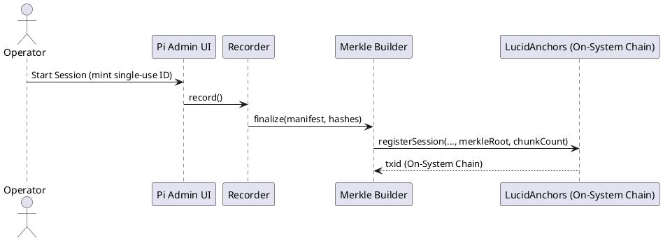
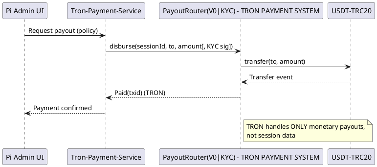

# SPEC-1B-v2: Method, Governance & Consensus (DISTROLESS)

## Introduction & Architectural Principles

Lucid RDP implements a three-tier architecture that clearly separates concerns between blockchain operations, payment systems, and container infrastructure:

- **Blockchain Tier (On-System Data Chain)**: Primary blockchain for session anchoring, consensus (PoOT), and governance
- **Payment Tier (TRON - ISOLATED)**: Payment system ONLY (USDT-TRC20 payouts via PayoutRouterV0/PRKYC)
- **Distroless Container Tier**: All container builds use distroless images with minimal attack surface

### Separation of Concerns
- **TRON = Payment System Only**: NO session anchoring, NO consensus participation, NO chunk storage, NO governance operations
- **On-System Data Chain**: ALL blockchain operations (anchoring, consensus, governance)
- **Distroless Security**: Minimal attack surface, no shells, read-only filesystems where possible

## Method - High-Level Architecture

```plantuml
@startuml
skinparam componentStyle rectangle
skinparam shadowing false

package "Raspberry Pi 5 (Ubuntu Server) - DISTROLESS" {
  [Admin UI (.onion, Next.js/Node 20)] as AdminUI
  [RDP Host (xrdp/Wayland)] as RDP
  [Session Recorder] as Rec
  [Chunker+Compressor (Zstd)] as Chunker
  [Encryptor (XChaCha20-Poly1305)] as Enc
  [Merkle Builder] as Merkle
  [On-System Chain Client] as OSC
  [DHT/CRDT Node] as DHT
  [Tron-Payment-Service] as TronService
  [Wallet Daemon (Ledger HW or SW Vault)] as Wallet
  [Local DB (MongoDB 7, WiredTiger)] as DB
  [Local Encrypted Chunk Store] as Store
  [Tor HS & SOCKS Proxy] as Tor
  [Beta Sidecar] as Beta
}

package "On-System Data Chain (Primary Blockchain)" {
  [LucidAnchors] as OSAnchors
  [LucidChunkStore] as OSChunks
  [LucidGovernor] as Gov
  [ParamRegistry] as ParamReg
}

package "Payment System (TRON - ISOLATED)" {
  note "PAYMENT OPERATIONS ONLY - NO CONSENSUS" as PaymentNote
  [PayoutRouterV0] as PR0
  [PayoutRouterKYC] as PRKYC
  [USDT-TRC20] as USDT
}

AdminUI -down-> RDP
RDP --> Rec
Rec --> Chunker --> Enc --> Store
Enc --> Merkle
Enc --> OSC : push chunks (encrypted)
Merkle --> OSC : anchor(manifest/root)
OSC --> OSAnchors
OSC --> OSChunks
AdminUI --> DB
AdminUI --> TronService : purchases, payouts ONLY
Wallet -left- TronService
DHT <..> DHT : gossip/replicate (encrypted indexes)
Tor .. AdminUI
Tor .. OSC
Tor .. TronService
Tor .. RDP
Beta .. TronService : wallet plane isolation
Beta .. OSC : chain plane isolation
PR0 --> USDT
PRKYC --> USDT

note right of TronService : ISOLATED PAYMENT SERVICE\nNO blockchain operations\nNO consensus participation\nNO session anchoring
@enduml
```

## Blockchain Tier: On-System Data Chain

### Session Anchoring (LucidAnchors, LucidChunkStore)
- **Primary Purpose**: Store encrypted, lossless-compressed session chunks and manifests on-chain
- **Contracts**: LucidAnchors (session registration), LucidChunkStore (chunk anchoring)
- **Data Flow**: Session → Encrypt → Merkle Root → Anchor to On-System Chain
- **MongoDB Collections**: sessions, chunks, task_proofs, work_tally

### PoOT Consensus (Immutable 120s Slots)
- **Work Credits**: Relay bandwidth, storage proofs, validation signatures, uptime beacons
- **Leader Selection**: Top-ranked entity based on operational work credits
- **Slot Timing**: 120s immutable slots (30 blocks/hour maximum)
- **Anti-Griefing**: Cooldown periods, timeout penalties, VRF tie-breaking

### Governance (On-System Chain Only)
- **LucidGovernor + Timelock**: Proposal → Vote → Timelock → Execution
- **ParamRegistry**: Bounded parameter adjustments only
- **Cross-Chain Governance**: TRON signer rotation controlled by On-System Governor
- **One-Node-One-Vote**: Eligibility based on 80% uptime + 1 LUCID earned

## Payment Tier: TRON (ISOLATED)

### Explicit Scope: USDT-TRC20 Payouts ONLY
**✅ ALLOWED Operations:**
- USDT-TRC20 transfers via PayoutRouterV0/PRKYC
- Energy/bandwidth management (TRX staking)
- Monthly payout distribution
- Wallet integration for payouts

**❌ PROHIBITED Operations:**
- Session anchoring (use On-System Chain)
- Consensus participation (use PoOT on On-System Chain)
- Chunk storage (use On-System Chain)
- Governance operations (use On-System Chain)
- Any blockchain operations beyond payments

### PayoutRouter Contracts
- **PayoutRouterV0**: Non-KYC route for general payouts
- **PayoutRouterKYC**: KYC-gated route for node worker payouts
- **Energy/Bandwidth Management**: TRX staking for transaction fees
- **MongoDB Collection**: payouts ONLY (isolated from blockchain data)

### Service Isolation
- **Container**: `tron-payment-service` (distroless)
- **Network Plane**: Wallet plane ONLY via Beta sidecar
- **Access Control**: Beta sidecar enforces wallet plane ACLs
- **Data Store**: Only accesses `payouts` collection

## Distroless Container Architecture

### Stage 0-6 Build Specifications (from Spec-4)
```
Stage 0: Base + Beta Sidecar
Stage 1: Blockchain Group (On-System Chain)
Stage 2: Sessions Group
Stage 3: Node Systems Group
Stage 4: Admin/Wallet Group (includes isolated TRON service)
Stage 5: Observability Group
Stage 6: Relay/Directory (optional)
```

### Container Standards
- **Base Images**: `gcr.io/distroless/nodejs20-debian12` or `gcr.io/distroless/python3-debian12`
- **Multi-stage Builds**: Builder stage + distroless runtime
- **Security**: No shell, no package managers in runtime
- **Filesystem**: Read-only root filesystem where possible
- **User**: Non-root user (UID 65532)
- **Syscalls**: Minimal syscalls (seccomp profiles)

### Example Distroless Pattern
```dockerfile
# Example distroless pattern
FROM node:20-slim AS builder
WORKDIR /build
COPY package*.json ./
RUN npm ci --only=production

FROM gcr.io/distroless/nodejs20-debian12
COPY --from=builder /build/node_modules /app/node_modules
COPY --chown=nonroot:nonroot src/ /app/
USER nonroot
WORKDIR /app
CMD ["index.js"]
```

## Service Isolation Rules

### TRON Service Boundaries
**Container**: `tron-payment-service`
- **Scope**: ONLY payment operations (USDT transfers)
- **Prohibited**: NO session anchoring, NO consensus participation, NO chunk storage
- **Network**: Wallet plane isolation enforced by Beta sidecar
- **Data**: Only `payouts` MongoDB collection

### On-System Chain Service Boundaries
**Container**: `blockchain-core`
- **Scope**: ALL session anchoring via LucidAnchors
- **Consensus**: ALL consensus (PoOT)
- **Governance**: ALL governance operations
- **Prohibited**: NO payment operations

### Inter-Service Communication
- **Transport**: Tor + Beta sidecar for all inter-service communication
- **Plane Separation**: Ops plane, Chain plane, Wallet plane
- **ACLs**: Beta sidecar enforces plane-based access control

## Data Flow & Sequences

### Session Recording → Anchoring (On-System Chain)


### Payout Request → TRON Payment Transfer


## Consensus (PoOT) - On-System Chain Only

### Work Credits Calculation
- **Inputs**: Relay bandwidth, storage proofs, validation signatures, uptime beacons
- **Window**: 7-day sliding window for credit calculation
- **Ranking**: Entities ranked by total work credits
- **Anti-Griefing**: Cooldown slots, timeout penalties

### Leader Selection
- **Primary Leader**: Top-ranked entity not in cooldown
- **Fallback**: Next ranked entity if primary fails to propose
- **VRF Tie-Breaking**: Seeded from previous block hash
- **Slot Management**: 120s immutable slots with 5s proposal timeout

### MongoDB Collections (Consensus)
```javascript
task_proofs: { 
  _id, nodeId, poolId?, slot, type, value, sig, ts 
} // sharded on { slot: 1, nodeId: 1 }

work_tally: { 
  _id: epoch, entityId, credits, liveScore, rank 
} // replicated

leader_schedule: { 
  _id, slot, primary: entityId, fallbacks: [entityId...], result: { winner, reason } 
} // replicated
```

## Governance - On-System Chain Only

### LucidGovernor + Timelock
- **Proposal Process**: Propose → Vote → Timelock → Execute
- **Non-Upgradeable**: All contracts immutable after deployment
- **Parameter Control**: Only explicit parameters in ParamRegistry
- **Role Rotation**: Where explicitly allowed by contract

### ParamRegistry (Bounded)
- **Bounded Keys**: payoutEpochLength, maxChunkSize, policyTimeoutMs
- **Safe Ranges**: Pre-defined bounds for all parameters
- **Governor Control**: Only Governor may set values within bounds
- **No Arbitrary Code**: No arbitrary code execution paths

### Cross-Chain Governance (TRON Signer Rotation)
- **Authority Selection**: On-System Governor controls TRON signer keys
- **Multisig**: 2-of-3 multisig for payout actions
- **Rotation Process**: On-chain vote → SignerRegistry update → Tron-Node System mirror

## Implementation Requirements

### Distroless Base Images
- **Node.js Services**: `gcr.io/distroless/nodejs20-debian12`
- **Python Services**: `gcr.io/distroless/python3-debian12`
- **Multi-stage Builds**: Builder + distroless runtime stages
- **Security Scanning**: SBOM generation, CVE checks, signature verification

### Container Isolation with Beta Sidecar
- **Plane Separation**: Ops, Chain, Wallet planes
- **ACL Enforcement**: Beta sidecar enforces plane-based access
- **Service Discovery**: Beta resolves service names to .onion addresses
- **Network Isolation**: No direct inter-plane communication

### Security Hardening
- **Read-only Root**: Where possible, mount root filesystem read-only
- **Non-root User**: UID 65532 (nonroot user)
- **Minimal Syscalls**: Seccomp profiles to limit system calls
- **No Shells**: No bash, sh, or other shells in runtime containers

## Compliance & Verification

### TRON Isolation Compliance
- **Code Reviews**: Must verify TRON isolation in all PRs
- **Container Verification**: TRON service runs in isolated container
- **Data Access**: MongoDB payouts collection is ONLY TRON-related data store
- **Network Verification**: Beta sidecar enforces wallet plane ACLs

### Distroless Compliance
- **CI/CD Checks**: All builds must verify distroless base images
- **Image Scanning**: SBOM and CVE checks before deployment
- **Signature Verification**: All images must be signed and verified
- **Deployment Gates**: No deployment without distroless compliance

### Service Boundary Verification
- **TRON Service**: Only payment operations, no blockchain functions
- **Blockchain Service**: Only blockchain operations, no payment functions
- **Data Isolation**: Clear separation between blockchain and payment data
- **Network Isolation**: Plane-based access control via Beta sidecar

## Conclusion

This specification establishes clear architectural boundaries between blockchain operations (On-System Data Chain) and payment operations (TRON), while mandating distroless container architecture for enhanced security. The separation ensures that TRON remains purely a payment system without involvement in consensus, anchoring, or governance operations.
