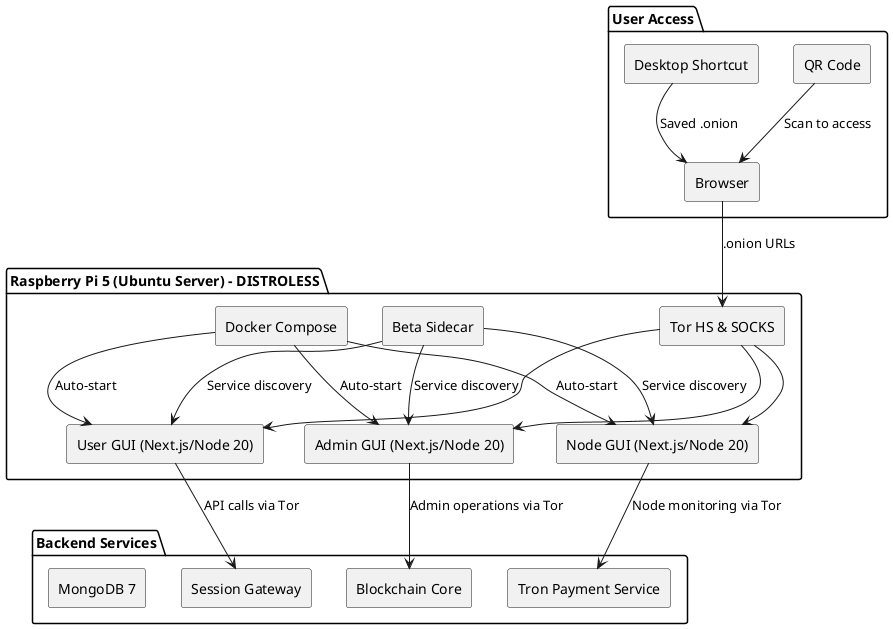

# SPEC-5 — Web-Based GUI System Architecture (DISTROLESS)

## Introduction & Architectural Principles

Lucid RDP implements a **web-based GUI system** that aligns with the distroless container architecture, Tor-only transport, and service isolation requirements. This system provides three distinct GUI interfaces through secure web applications running in distroless containers.

### Core Design Principles
- **Web-First Architecture**: All GUIs are web applications accessible via browser
- **Distroless Security**: All GUI containers use distroless base images with minimal attack surface
- **Tor-Only Access**: All GUI access via .onion endpoints, no clearnet ingress
- **Service Integration**: GUIs connect to backend APIs through Tor transport
- **Container Orchestration**: All GUIs managed via Docker Compose with auto-start

## GUI System Overview

### Three GUI Types

1. **User GUI** - End-user session management and control
2. **Admin GUI** - Pi appliance administration and provisioning  
3. **Node GUI** - Node worker monitoring and PoOT management

### Architecture Diagram



## Container Architecture

### Distroless Container Pattern

All GUI containers follow the distroless pattern:

```dockerfile
# Example GUI container pattern
FROM node:20-slim AS builder
WORKDIR /build
COPY package*.json ./
RUN npm ci --only=production

FROM gcr.io/distroless/nodejs20-debian12
COPY --from=builder /build/node_modules /app/node_modules
COPY --chown=nonroot:nonroot src/ /app/
USER nonroot
WORKDIR /app
CMD ["index.js"]
```

### Container Specifications

| GUI Type | Container Name | Base Image | Port | Plane |
|----------|----------------|------------|------|-------|
| User GUI | `lucid-user-gui` | `gcr.io/distroless/nodejs20-debian12` | 3001 | ops |
| Admin GUI | `lucid-admin-gui` | `gcr.io/distroless/nodejs20-debian12` | 3002 | ops |
| Node GUI | `lucid-node-gui` | `gcr.io/distroless/nodejs20-debian12` | 3003 | ops |

### Security Features

- **Non-root User**: UID 65532 (nonroot user)
- **Read-only Root**: Read-only filesystem where possible
- **No Shells**: No bash, sh, or other shells in runtime
- **Minimal Syscalls**: Seccomp profiles to limit system calls
- **Tor Integration**: All traffic forced through Tor SOCKS

## Tor Network Integration

### .onion Service Configuration

```bash
# /etc/tor/torrc
HiddenServiceDir /var/lib/tor/lucid-user-gui
HiddenServicePort 80 127.0.0.1:3001

HiddenServiceDir /var/lib/tor/lucid-admin-gui  
HiddenServicePort 80 127.0.0.1:3002

HiddenServiceDir /var/lib/tor/lucid-node-gui
HiddenServicePort 80 127.0.0.1:3003
```

### Beta Sidecar Integration

```yaml
# Beta sidecar configuration for GUI services
services:
  beta:
    image: lucid/beta-sidecar
    environment:
      - BETA_CLUSTER_ID=gui-cluster
      - BETA_PLANES=ops,chain,wallet
    volumes:
      - tor-data:/var/lib/tor
    labels:
      - "com.lucid.plane=ops"
      - "com.lucid.service=gui"
      - "com.lucid.expose=true"
```

### Service Discovery

GUIs use Beta sidecar for service discovery:

```javascript
// Example service discovery in GUI
const serviceUrl = await beta.resolve('sessions-gateway@ops');
const response = await fetch(`${serviceUrl}/api/sessions`, {
  method: 'GET',
  headers: {
    'Authorization': `Bearer ${token}`
  }
});
```

## GUI Applications

### 1. User GUI

**Purpose**: End-user session management and control

**Features**:
- Session connect/join via QR code or session ID
- Client policy enforcement (clipboard, file, devices, privacy shield)
- Real-time session monitoring
- Proofs viewer and export
- Connection settings and preferences

**Technology Stack**:
- **Frontend**: Next.js 14 with TypeScript
- **Styling**: Tailwind CSS
- **State Management**: Zustand
- **HTTP Client**: Axios with Tor SOCKS proxy
- **Authentication**: JWT with magic link + TOTP

**Key Components**:
```
src/
├── components/
│   ├── SessionManager.tsx
│   ├── PolicyEditor.tsx
│   ├── ProofsViewer.tsx
│   └── ConnectionSettings.tsx
├── pages/
│   ├── index.tsx          # Dashboard
│   ├── session/[id].tsx   # Session view
│   ├── proofs.tsx         # Proofs list
│   └── settings.tsx       # Settings
├── services/
│   ├── api.ts             # API client
│   ├── tor.ts             # Tor integration
│   └── auth.ts            # Authentication
└── utils/
    ├── policy.ts          # Policy validation
    └── encryption.ts      # Client-side encryption
```

### 2. Admin GUI

**Purpose**: Pi appliance administration and provisioning

**Features**:
- Bootstrap and provisioning wizard
- Session manifests and anchor visibility
- Payout router toggle (PR0/PRKYC)
- Key rotation and backup management
- System diagnostics and monitoring
- OTA update management

**Technology Stack**:
- **Frontend**: Next.js 14 with TypeScript
- **Styling**: Tailwind CSS
- **State Management**: Zustand
- **HTTP Client**: Axios with Tor SOCKS proxy
- **Authentication**: JWT with magic link + TOTP
- **Charts**: Chart.js for monitoring dashboards

**Key Components**:
```
src/
├── components/
│   ├── BootstrapWizard.tsx
│   ├── ManifestsViewer.tsx
│   ├── PayoutManager.tsx
│   ├── KeyManager.tsx
│   ├── Diagnostics.tsx
│   └── OTAManager.tsx
├── pages/
│   ├── index.tsx          # Dashboard
│   ├── bootstrap.tsx      # Bootstrap wizard
│   ├── manifests.tsx      # Session manifests
│   ├── payouts.tsx        # Payout management
│   ├── keys.tsx           # Key management
│   ├── diagnostics.tsx    # System diagnostics
│   └── updates.tsx        # OTA updates
├── services/
│   ├── api.ts             # API client
│   ├── blockchain.ts      # Blockchain operations
│   └── tron.ts            # TRON operations
└── utils/
    ├── validation.ts      # Form validation
    └── crypto.ts          # Cryptographic operations
```

### 3. Node GUI

**Purpose**: Node worker monitoring and PoOT management

**Features**:
- WorkCredits and PoOT metrics dashboard
- Relay and storage availability monitoring
- Leader slot tracking and statistics
- Energy and TRX budgeting
- Payout batch monitoring
- Watchdog alerts and notifications

**Technology Stack**:
- **Frontend**: Next.js 14 with TypeScript
- **Styling**: Tailwind CSS
- **State Management**: Zustand
- **HTTP Client**: Axios with Tor SOCKS proxy
- **Authentication**: JWT with magic link + TOTP
- **Real-time**: WebSocket connections via Tor
- **Charts**: Chart.js for metrics visualization

**Key Components**:
```
src/
├── components/
│   ├── MetricsDashboard.tsx
│   ├── WorkCreditsViewer.tsx
│   ├── RelayMonitor.tsx
│   ├── LeaderSchedule.tsx
│   ├── EnergyBudget.tsx
│   ├── PayoutBatches.tsx
│   └── AlertsManager.tsx
├── pages/
│   ├── index.tsx          # Dashboard
│   ├── metrics.tsx        # WorkCredits/PoOT metrics
│   ├── relay.tsx          # Relay monitoring
│   ├── leadership.tsx     # Leader schedule
│   ├── energy.tsx         # Energy budgeting
│   ├── payouts.tsx        # Payout batches
│   └── alerts.tsx         # Alerts management
├── services/
│   ├── api.ts             # API client
│   ├── websocket.ts       # Real-time connections
│   └── metrics.ts         # Metrics collection
└── utils/
    ├── calculations.ts    # PoOT calculations
    └── formatting.ts      # Data formatting
```

## Launch Mechanisms

### 1. QR Code Bootstrap (Primary)

**Purpose**: Zero-configuration access for users

**Implementation**:
```bash
#!/bin/bash
# /usr/local/bin/lucid-gui-qr.sh
set -euo pipefail

# Generate QR codes for all GUI services
USER_ONION=$(cat /var/lib/tor/lucid-user-gui/hostname)
ADMIN_ONION=$(cat /var/lib/tor/lucid-admin-gui/hostname)
NODE_ONION=$(cat /var/lib/tor/lucid-node-gui/hostname)

echo "=== Lucid RDP GUI Access ==="
echo ""
echo "User GUI (End Users):"
echo "https://${USER_ONION}"
qrencode -t ANSI256 "https://${USER_ONION}"
echo ""
echo "Admin GUI (Operators):"
echo "https://${ADMIN_ONION}"
qrencode -t ANSI256 "https://${ADMIN_ONION}"
echo ""
echo "Node GUI (Node Workers):"
echo "https://${NODE_ONION}"
qrencode -t ANSI256 "https://${NODE_ONION}"
```

**Usage Flow**:
1. Pi boots and displays QR codes on HDMI/serial
2. User scans QR code with phone/device
3. Browser opens with .onion URL
4. User accesses GUI immediately

### 2. Cloud-Init Auto-Setup

**Purpose**: Automated deployment and configuration

**Implementation**:
```yaml
# ops/cloud-init/lucid-gui-setup.yml
#cloud-config
write_files:
  - path: /etc/systemd/system/lucid-gui.service
    content: |
      [Unit]
      Description=Lucid GUI Services
      After=docker.service tor.service
      Requires=docker.service tor.service
      
      [Service]
      Type=oneshot
      ExecStart=/usr/local/bin/lucid-gui-start.sh
      RemainAfterExit=yes
      
      [Install]
      WantedBy=multi-user.target

  - path: /usr/local/bin/lucid-gui-start.sh
    content: |
      #!/bin/bash
      set -euo pipefail
      
      # Wait for Docker and Tor
      until docker info >/dev/null 2>&1; do sleep 1; done
      until nc -z localhost 9050; do sleep 1; done
      
      # Start GUI services
      cd /opt/lucid
      docker compose --profile gui up -d
      
      # Display QR codes
      /usr/local/bin/lucid-gui-qr.sh

runcmd:
  - chmod +x /usr/local/bin/lucid-gui-start.sh
  - systemctl enable lucid-gui.service
  - systemctl start lucid-gui.service
```

### 3. Desktop Shortcut (Optional)

**Purpose**: Local access for development and testing

**Implementation**:
```desktop
# /usr/share/applications/lucid-user-gui.desktop
[Desktop Entry]
Version=1.0
Type=Application
Name=Lucid User GUI
Comment=Access Lucid RDP User Interface
Exec=xdg-open https://$(cat /var/lib/tor/lucid-user-gui/hostname)
Icon=lucid-user
Terminal=false
Categories=Network;RemoteAccess;

# /usr/share/applications/lucid-admin-gui.desktop
[Desktop Entry]
Version=1.0
Type=Application
Name=Lucid Admin GUI
Comment=Access Lucid RDP Admin Interface
Exec=xdg-open https://$(cat /var/lib/tor/lucid-admin-gui/hostname)
Icon=lucid-admin
Terminal=false
Categories=Network;RemoteAccess;

# /usr/share/applications/lucid-node-gui.desktop
[Desktop Entry]
Version=1.0
Type=Application
Name=Lucid Node GUI
Comment=Access Lucid RDP Node Interface
Exec=xdg-open https://$(cat /var/lib/tor/lucid-node-gui/hostname)
Icon=lucid-node
Terminal=false
Categories=Network;RemoteAccess;
```

## Docker Compose Integration

### GUI Services Configuration

```yaml
# infrastructure/compose/docker-compose.gui.yml
services:
  # User GUI
  lucid-user-gui:
    build:
      context: ./apps/gui-user
      dockerfile: Dockerfile.distroless
      target: production
    image: ghcr.io/hamigames/lucid/user-gui:latest
    container_name: lucid-user-gui
    restart: unless-stopped
    ports:
      - "3001:3001"
    environment:
      - NODE_ENV=production
      - PORT=3001
      - TOR_SOCKS=beta:9050
      - API_BASE_URL=https://sessions-gateway.onion
    depends_on:
      - beta
      - tor
    networks:
      - lucid-gui-net
    labels:
      - "com.lucid.plane=ops"
      - "com.lucid.service=gui"
      - "com.lucid.gui-type=user"
    profiles: ["gui", "user"]

  # Admin GUI
  lucid-admin-gui:
    build:
      context: ./apps/gui-admin
      dockerfile: Dockerfile.distroless
      target: production
    image: ghcr.io/hamigames/lucid/admin-gui:latest
    container_name: lucid-admin-gui
    restart: unless-stopped
    ports:
      - "3002:3002"
    environment:
      - NODE_ENV=production
      - PORT=3002
      - TOR_SOCKS=beta:9050
      - API_BASE_URL=https://blockchain-core.onion
    depends_on:
      - beta
      - tor
    networks:
      - lucid-gui-net
    labels:
      - "com.lucid.plane=ops"
      - "com.lucid.service=gui"
      - "com.lucid.gui-type=admin"
    profiles: ["gui", "admin"]

  # Node GUI
  lucid-node-gui:
    build:
      context: ./apps/gui-node
      dockerfile: Dockerfile.distroless
      target: production
    image: ghcr.io/hamigames/lucid/node-gui:latest
    container_name: lucid-node-gui
    restart: unless-stopped
    ports:
      - "3003:3003"
    environment:
      - NODE_ENV=production
      - PORT=3003
      - TOR_SOCKS=beta:9050
      - API_BASE_URL=https://tron-payment-service.onion
    depends_on:
      - beta
      - tor
    networks:
      - lucid-gui-net
    labels:
      - "com.lucid.plane=ops"
      - "com.lucid.service=gui"
      - "com.lucid.gui-type=node"
    profiles: ["gui", "node"]

networks:
  lucid-gui-net:
    name: lucid-gui-net
    driver: bridge
    attachable: true
    ipam:
      config:
        - subnet: 172.21.0.0/16
          gateway: 172.21.0.1
```

## Security Implementation

### Trust-Nothing Policy Engine

```typescript
// Trust-nothing policy enforcement in GUIs
interface TrustPolicy {
  allowedOrigins: string[];
  allowedMethods: string[];
  allowedHeaders: string[];
  maxRequestSize: number;
  rateLimit: {
    windowMs: number;
    maxRequests: number;
  };
}

class TrustPolicyEngine {
  private policy: TrustPolicy;
  
  constructor(policy: TrustPolicy) {
    this.policy = policy;
  }
  
  validateRequest(request: Request): boolean {
    // Validate origin
    if (!this.policy.allowedOrigins.includes(request.origin)) {
      return false;
    }
    
    // Validate method
    if (!this.policy.allowedMethods.includes(request.method)) {
      return false;
    }
    
    // Validate size
    if (request.size > this.policy.maxRequestSize) {
      return false;
    }
    
    return true;
  }
  
  enforceRateLimit(ip: string): boolean {
    // Rate limiting implementation
    return true;
  }
}
```

### Client-Side Encryption

```typescript
// Client-side encryption for sensitive data
import { encrypt, decrypt } from 'libsodium-wrappers';

class ClientEncryption {
  private key: Uint8Array;
  
  constructor(password: string) {
    this.key = this.deriveKey(password);
  }
  
  private deriveKey(password: string): Uint8Array {
    // Argon2id key derivation
    return crypto.subtle.digest('SHA-256', 
      new TextEncoder().encode(password)
    );
  }
  
  encrypt(data: string): string {
    const nonce = crypto.getRandomValues(new Uint8Array(24));
    const ciphertext = encrypt(data, nonce, this.key);
    return btoa(JSON.stringify({ nonce, ciphertext }));
  }
  
  decrypt(encryptedData: string): string {
    const { nonce, ciphertext } = JSON.parse(atob(encryptedData));
    return decrypt(ciphertext, nonce, this.key);
  }
}
```

### Tor Integration

```typescript
// Tor SOCKS proxy integration
import { SocksProxyAgent } from 'socks-proxy-agent';

class TorClient {
  private agent: SocksProxyAgent;
  
  constructor() {
    this.agent = new SocksProxyAgent('socks5://127.0.0.1:9050');
  }
  
  async makeRequest(url: string, options: RequestInit = {}): Promise<Response> {
    // Ensure URL is .onion
    if (!url.includes('.onion')) {
      throw new Error('Only .onion URLs allowed');
    }
    
    return fetch(url, {
      ...options,
      agent: this.agent
    });
  }
  
  async healthCheck(): Promise<boolean> {
    try {
      const response = await this.makeRequest('http://check.torproject.org/');
      return response.ok;
    } catch {
      return false;
    }
  }
}
```

## Build and Deployment

### Multi-Stage Dockerfile

```dockerfile
# apps/gui-user/Dockerfile.distroless
FROM node:20-slim AS builder

WORKDIR /build

# Copy package files
COPY package*.json ./
COPY next.config.js ./
COPY tailwind.config.js ./
COPY tsconfig.json ./

# Install dependencies
RUN npm ci --only=production && npm cache clean --force

# Copy source code
COPY src/ ./src/
COPY public/ ./public/

# Build application
RUN npm run build

# Production stage - Distroless
FROM gcr.io/distroless/nodejs20-debian12

# Copy built application
COPY --from=builder --chown=nonroot:nonroot /build/.next/standalone /app
COPY --from=builder --chown=nonroot:nonroot /build/.next/static /app/.next/static
COPY --from=builder --chown=nonroot:nonroot /build/public /app/public

# Set user and working directory
USER nonroot
WORKDIR /app

# Expose port
EXPOSE 3001

# Start application
CMD ["node", "server.js"]
```

### Build Scripts

```bash
#!/bin/bash
# build/scripts/build-gui-distroless.sh
set -euo pipefail

SERVICES="user admin node"
REGISTRY="ghcr.io"
IMAGE_NAME="hamigames/lucid"

for service in $SERVICES; do
  echo "Building $service GUI..."
  
  docker buildx build \
    --platform linux/amd64,linux/arm64 \
    --file apps/gui-$service/Dockerfile.distroless \
    --tag $REGISTRY/$IMAGE_NAME/$service-gui:latest \
    --tag $REGISTRY/$IMAGE_NAME/$service-gui:$GITHUB_SHA \
    --push \
    apps/gui-$service/
    
  echo "✅ $service GUI built successfully"
done
```

### Deployment Scripts

```bash
#!/bin/bash
# build/scripts/deploy-gui-pi.sh
set -euo pipefail

PI_HOST="${PI_HOST:-raspberrypi.local}"
SERVICES="${SERVICES:-user,admin,node}"

# Deploy GUI services to Pi
ssh -i ~/.ssh/pi_key $PI_USER@$PI_HOST << EOF
  # Pull latest images
  for service in $(echo "$SERVICES" | tr ',' ' '); do
    docker pull $REGISTRY/$IMAGE_NAME/\$service-gui:latest
  done
  
  # Update and restart services
  cd /opt/lucid
  docker compose --profile gui up -d
  
  # Display QR codes
  /usr/local/bin/lucid-gui-qr.sh
EOF
```

## Testing and Validation

### Unit Tests

```typescript
// apps/gui-user/src/__tests__/TrustPolicy.test.ts
import { TrustPolicyEngine } from '../utils/TrustPolicy';

describe('TrustPolicyEngine', () => {
  let engine: TrustPolicyEngine;
  
  beforeEach(() => {
    engine = new TrustPolicyEngine({
      allowedOrigins: ['https://*.onion'],
      allowedMethods: ['GET', 'POST'],
      allowedHeaders: ['Authorization', 'Content-Type'],
      maxRequestSize: 1024 * 1024, // 1MB
      rateLimit: {
        windowMs: 60000, // 1 minute
        maxRequests: 100
      }
    });
  });
  
  test('should validate .onion requests', () => {
    const request = {
      origin: 'https://test.onion',
      method: 'GET',
      size: 1024
    };
    
    expect(engine.validateRequest(request)).toBe(true);
  });
  
  test('should reject clearnet requests', () => {
    const request = {
      origin: 'https://example.com',
      method: 'GET',
      size: 1024
    };
    
    expect(engine.validateRequest(request)).toBe(false);
  });
});
```

### Integration Tests

```typescript
// tests/integration/gui-integration.test.ts
import { test, expect } from '@playwright/test';

test.describe('GUI Integration Tests', () => {
  test('User GUI should be accessible via .onion', async ({ page }) => {
    const onionUrl = process.env.USER_GUI_ONION_URL;
    
    await page.goto(onionUrl);
    await expect(page).toHaveTitle(/Lucid User GUI/);
    
    // Test Tor connectivity
    const torStatus = await page.evaluate(() => {
      return window.navigator.userAgent.includes('Tor');
    });
    
    expect(torStatus).toBe(true);
  });
  
  test('Admin GUI should require authentication', async ({ page }) => {
    const onionUrl = process.env.ADMIN_GUI_ONION_URL;
    
    await page.goto(onionUrl);
    await expect(page.locator('[data-testid="login-form"]')).toBeVisible();
  });
});
```

## Compliance Verification

### Distroless Compliance

```bash
#!/bin/bash
# build/scripts/verify-distroless-gui.sh
set -euo pipefail

SERVICES="user admin node"
REGISTRY="ghcr.io"
IMAGE_NAME="hamigames/lucid"

for service in $SERVICES; do
  echo "Verifying $service GUI distroless compliance..."
  
  # Check base image
  docker run --rm $REGISTRY/$IMAGE_NAME/$service-gui:latest \
    /bin/sh -c "echo 'Checking for shell...' && which sh" || echo "✅ No shell found"
    
  # Check user
  USER=$(docker run --rm $REGISTRY/$IMAGE_NAME/$service-gui:latest \
    /bin/sh -c "id -u" 2>/dev/null || echo "nonroot")
    
  if [ "$USER" = "65532" ]; then
    echo "✅ Correct user (nonroot)"
  else
    echo "❌ Wrong user: $USER"
    exit 1
  fi
  
  # Check read-only root
  docker run --rm $REGISTRY/$IMAGE_NAME/$service-gui:latest \
    /bin/sh -c "touch /test 2>/dev/null && echo '❌ Writable root' || echo '✅ Read-only root'"
done
```

### Tor Integration Compliance

```bash
#!/bin/bash
# build/scripts/verify-tor-gui.sh
set -euo pipefail

echo "Verifying Tor integration..."

# Check .onion services are running
for service in user admin node; do
  ONION_FILE="/var/lib/tor/lucid-$service-gui/hostname"
  if [ -f "$ONION_FILE" ]; then
    ONION_URL=$(cat "$ONION_FILE")
    echo "✅ $service GUI .onion: $ONION_URL"
  else
    echo "❌ $service GUI .onion service not found"
    exit 1
  fi
done

# Test connectivity
for service in user admin node; do
  ONION_URL=$(cat "/var/lib/tor/lucid-$service-gui/hostname")
  if curl -f --socks5 127.0.0.1:9050 "http://$ONION_URL" >/dev/null 2>&1; then
    echo "✅ $service GUI accessible via Tor"
  else
    echo "❌ $service GUI not accessible via Tor"
    exit 1
  fi
done
```

## Conclusion

This web-based GUI system provides a secure, distroless-compliant interface for all Lucid RDP operations while maintaining the trust-nothing security model and Tor-only transport requirements. The three launch mechanisms ensure flexible access while the containerized architecture integrates seamlessly with the existing build and deployment pipelines.

### Key Benefits

1. **Security**: Distroless containers with minimal attack surface
2. **Accessibility**: Web-based access from any device with browser
3. **Simplicity**: QR code bootstrap for zero-configuration access
4. **Integration**: Seamless integration with existing service architecture
5. **Compliance**: Full compliance with SPEC-1 requirements
6. **Maintainability**: Standard web technologies with TypeScript

### Compliance Checklist

- ✅ **Distroless Architecture**: All containers use `gcr.io/distroless/nodejs20-debian12`
- ✅ **Tor Integration**: All access via .onion endpoints
- ✅ **Service Integration**: GUIs connect to backend APIs via Tor
- ✅ **Security**: Trust-nothing policy engine and client-side encryption
- ✅ **Container Orchestration**: Docker Compose with auto-start
- ✅ **Build Integration**: Multi-stage builds with existing pipeline
- ✅ **Launch Mechanisms**: QR code, Cloud-init, and Desktop shortcuts
- ✅ **Testing**: Comprehensive unit and integration tests
