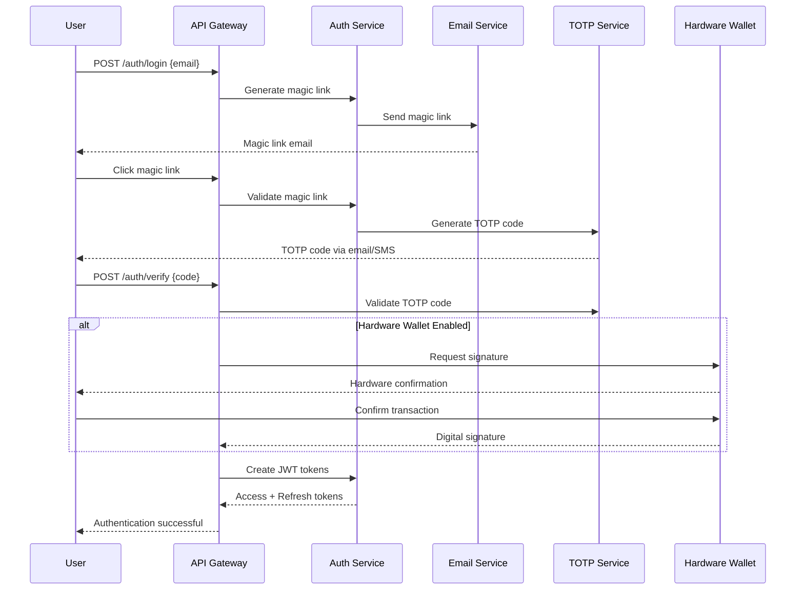

# API Gateway Cluster - Security & Compliance

## Overview

This document defines the comprehensive security architecture, authentication mechanisms, authorization controls, rate limiting strategies, and audit logging requirements for the API Gateway cluster.

## Security Architecture

### Security Layers

```
┌─────────────────────────────────────────────────────────────┐
│                    Security Layers                         │
│                                                             │
│  ┌─────────────────────────────────────────────────────┐   │
│  │                Application Layer                     │   │
│  │  - Input Validation                                 │   │
│  │  - Business Logic Security                          │   │
│  │  - Data Sanitization                                │   │
│  └─────────────────────────────────────────────────────┘   │
│                                                             │
│  ┌─────────────────────────────────────────────────────┐   │
│  │                Authentication Layer                  │   │
│  │  - JWT Token Validation                             │   │
│  │  - Magic Link Authentication                        │   │
│  │  - TOTP Verification                                │   │
│  │  - Hardware Wallet Integration                      │   │
│  └─────────────────────────────────────────────────────┘   │
│                                                             │
│  ┌─────────────────────────────────────────────────────┐   │
│  │                Authorization Layer                   │   │
│  │  - Role-Based Access Control (RBAC)                 │   │
│  │  - Resource-Level Permissions                       │   │
│  │  - API Endpoint Protection                          │   │
│  └─────────────────────────────────────────────────────┘   │
│                                                             │
│  ┌─────────────────────────────────────────────────────┐   │
│  │                Network Security Layer                │   │
│  │  - TLS 1.3 Encryption                               │   │
│  │  - Rate Limiting & DDoS Protection                  │   │
│  │  - CORS Configuration                               │   │
│  │  - Trusted Host Validation                          │   │
│  └─────────────────────────────────────────────────────┘   │
│                                                             │
│  ┌─────────────────────────────────────────────────────┐   │
│  │                Infrastructure Layer                  │   │
│  │  - Distroless Containers                            │   │
│  │  - Non-Root User Execution                          │   │
│  │  - Minimal Attack Surface                           │   │
│  │  - Security Scanning                                │   │
│  └─────────────────────────────────────────────────────┘   │
└─────────────────────────────────────────────────────────────┘
```

## Authentication Architecture

### Multi-Factor Authentication Flow



### JWT Token Structure

```json
{
  "header": {
    "alg": "HS256",
    "typ": "JWT"
  },
  "payload": {
    "jti": "token-uuid-here",
    "sub": "user-uuid-here",
    "user_id": "user-uuid-here",
    "email": "user@example.com",
    "username": "username",
    "role": "user",
    "permissions": ["session:create", "session:read"],
    "iat": 1704908400,
    "exp": 1704909300,
    "iss": "api-gateway",
    "aud": "lucid-blockchain"
  }
}
```

### Token Management

```python
class TokenManager:
    """JWT token management with security best practices"""
    
    def __init__(self, secret_key: str, algorithm: str = "HS256"):
        self.secret_key = secret_key
        self.algorithm = algorithm
        self.access_token_expire_minutes = 15
        self.refresh_token_expire_days = 7
    
    def create_access_token(self, user_data: dict) -> str:
        """Create short-lived access token"""
        payload = {
            "jti": str(uuid.uuid4()),
            "sub": str(user_data["user_id"]),
            "user_id": str(user_data["user_id"]),
            "email": user_data["email"],
            "username": user_data["username"],
            "role": user_data["role"],
            "permissions": user_data.get("permissions", []),
            "iat": datetime.utcnow(),
            "exp": datetime.utcnow() + timedelta(minutes=self.access_token_expire_minutes),
            "iss": "api-gateway",
            "aud": "lucid-blockchain",
            "type": "access"
        }
        
        return jwt.encode(payload, self.secret_key, algorithm=self.algorithm)
    
    def create_refresh_token(self, user_data: dict) -> str:
        """Create long-lived refresh token"""
        payload = {
            "jti": str(uuid.uuid4()),
            "sub": str(user_data["user_id"]),
            "user_id": str(user_data["user_id"]),
            "iat": datetime.utcnow(),
            "exp": datetime.utcnow() + timedelta(days=self.refresh_token_expire_days),
            "iss": "api-gateway",
            "aud": "lucid-blockchain",
            "type": "refresh"
        }
        
        return jwt.encode(payload, self.secret_key, algorithm=self.algorithm)
    
    def validate_token(self, token: str) -> dict:
        """Validate and decode JWT token"""
        try:
            payload = jwt.decode(
                token,
                self.secret_key,
                algorithms=[self.algorithm],
                audience="lucid-blockchain",
                issuer="api-gateway"
            )
            
            # Check token type
            if payload.get("type") not in ["access", "refresh"]:
                raise JWTError("Invalid token type")
            
            return payload
            
        except ExpiredSignatureError:
            raise JWTError("Token has expired")
        except JWTClaimsError as e:
            raise JWTError(f"Invalid token claims: {e}")
        except JWTError as e:
            raise JWTError(f"Invalid token: {e}")
    
    async def blacklist_token(self, jti: str, expires_at: datetime):
        """Add token to blacklist"""
        redis_client = redis.from_url(settings.REDIS_URL)
        await redis_client.setex(
            f"blacklist:{jti}",
            int((expires_at - datetime.utcnow()).total_seconds()),
            "blacklisted"
        )
```

## Authorization Framework

### Role-Based Access Control (RBAC)

```python
class UserRole(str, Enum):
    USER = "user"
    NODE_OPERATOR = "node_operator"
    ADMIN = "admin"
    SUPER_ADMIN = "super_admin"

class Permission(str, Enum):
    # User permissions
    USER_READ = "user:read"
    USER_UPDATE = "user:update"
    USER_DELETE = "user:delete"
    
    # Session permissions
    SESSION_CREATE = "session:create"
    SESSION_READ = "session:read"
    SESSION_UPDATE = "session:update"
    SESSION_DELETE = "session:delete"
    
    # Blockchain permissions
    BLOCKCHAIN_READ = "blockchain:read"
    BLOCKCHAIN_WRITE = "blockchain:write"
    
    # Admin permissions
    ADMIN_READ = "admin:read"
    ADMIN_WRITE = "admin:write"
    ADMIN_DELETE = "admin:delete"
    
    # System permissions
    SYSTEM_MANAGE = "system:manage"
    SYSTEM_MONITOR = "system:monitor"

# Role-Permission mapping
ROLE_PERMISSIONS = {
    UserRole.USER: [
        Permission.USER_READ,
        Permission.USER_UPDATE,
        Permission.SESSION_CREATE,
        Permission.SESSION_READ,
        Permission.SESSION_UPDATE,
        Permission.SESSION_DELETE,
        Permission.BLOCKCHAIN_READ
    ],
    UserRole.NODE_OPERATOR: [
        Permission.USER_READ,
        Permission.USER_UPDATE,
        Permission.SESSION_CREATE,
        Permission.SESSION_READ,
        Permission.SESSION_UPDATE,
        Permission.SESSION_DELETE,
        Permission.BLOCKCHAIN_READ,
        Permission.BLOCKCHAIN_WRITE,
        Permission.SYSTEM_MONITOR
    ],
    UserRole.ADMIN: [
        Permission.USER_READ,
        Permission.USER_UPDATE,
        Permission.USER_DELETE,
        Permission.SESSION_CREATE,
        Permission.SESSION_READ,
        Permission.SESSION_UPDATE,
        Permission.SESSION_DELETE,
        Permission.BLOCKCHAIN_READ,
        Permission.BLOCKCHAIN_WRITE,
        Permission.ADMIN_READ,
        Permission.ADMIN_WRITE,
        Permission.SYSTEM_MONITOR
    ],
    UserRole.SUPER_ADMIN: [
        # All permissions
        *[perm for perm in Permission]
    ]
}

class AuthorizationService:
    """Authorization service for RBAC implementation"""
    
    def __init__(self):
        self.role_permissions = ROLE_PERMISSIONS
    
    def has_permission(self, user_role: UserRole, permission: Permission) -> bool:
        """Check if user role has specific permission"""
        role_permissions = self.role_permissions.get(user_role, [])
        return permission in role_permissions
    
    def get_user_permissions(self, user_role: UserRole) -> List[Permission]:
        """Get all permissions for a user role"""
        return self.role_permissions.get(user_role, [])
    
    def check_resource_access(self, user_id: str, resource_id: str, action: str) -> bool:
        """Check if user can access specific resource"""
        # Implement resource-level access control
        # This would check if user owns the resource or has admin access
        pass
```

### API Endpoint Protection

```python
# Protected endpoint decorators
def require_permission(permission: Permission):
    """Decorator to require specific permission for endpoint"""
    def decorator(func):
        @wraps(func)
        async def wrapper(*args, **kwargs):
            # Get current user from request context
            current_user = get_current_user()
            
            # Check permission
            if not auth_service.has_permission(current_user.role, permission):
                raise HTTPException(
                    status_code=403,
                    detail="Insufficient permissions"
                )
            
            return await func(*args, **kwargs)
        return wrapper
    return decorator

def require_ownership(resource_field: str):
    """Decorator to require resource ownership"""
    def decorator(func):
        @wraps(func)
        async def wrapper(*args, **kwargs):
            current_user = get_current_user()
            
            # Extract resource ID from request
            resource_id = kwargs.get(resource_field)
            
            # Check ownership
            if not auth_service.check_resource_access(current_user.user_id, resource_id, "read"):
                raise HTTPException(
                    status_code=403,
                    detail="Access denied to resource"
                )
            
            return await func(*args, **kwargs)
        return wrapper
    return decorator

# Usage examples
@router.get("/sessions/{session_id}")
@require_permission(Permission.SESSION_READ)
@require_ownership("session_id")
async def get_session(session_id: str):
    """Get session details - requires SESSION_READ permission and ownership"""
    pass
```

## Rate Limiting & DDoS Protection

### Tiered Rate Limiting Implementation

```python
class RateLimitConfig:
    """Rate limiting configuration for different endpoint tiers"""
    
    # Public endpoints - minimal rate limiting
    PUBLIC_LIMITS = {
        "requests_per_minute": 100,
        "burst_size": 200,
        "window_seconds": 60
    }
    
    # Authenticated endpoints - higher limits
    AUTHENTICATED_LIMITS = {
        "requests_per_minute": 1000,
        "burst_size": 2000,
        "window_seconds": 60
    }
    
    # Admin endpoints - very high limits
    ADMIN_LIMITS = {
        "requests_per_minute": 10000,
        "burst_size": 20000,
        "window_seconds": 60
    }
    
    # Chunk upload endpoints - bandwidth-based limiting
    CHUNK_UPLOAD_LIMITS = {
        "bytes_per_second": 10485760,  # 10 MB/sec
        "burst_bytes": 20971520,       # 20 MB burst
        "window_seconds": 1
    }
    
    # Blockchain query endpoints - moderate limits
    BLOCKCHAIN_QUERY_LIMITS = {
        "requests_per_minute": 500,
        "burst_size": 1000,
        "window_seconds": 60
    }

class AdvancedRateLimiter:
    """Advanced rate limiter with adaptive limiting and DDoS protection"""
    
    def __init__(self, redis_client):
        self.redis = redis_client
        self.config = RateLimitConfig()
        self.suspicious_ips = set()
        self.blocked_ips = set()
    
    async def check_rate_limit(self, request: Request) -> bool:
        """Check if request should be allowed based on rate limits"""
        # Get client identifier
        client_id = self._get_client_identifier(request)
        
        # Check if IP is blocked
        if client_id in self.blocked_ips:
            return False
        
        # Check if IP is suspicious
        if client_id in self.suspicious_ips:
            # Apply stricter rate limits
            return await self._check_suspicious_rate_limit(client_id, request)
        
        # Normal rate limiting
        return await self._check_normal_rate_limit(client_id, request)
    
    async def _check_normal_rate_limit(self, client_id: str, request: Request) -> bool:
        """Apply normal rate limiting"""
        endpoint_tier = self._get_endpoint_tier(request)
        limits = self._get_limits_for_tier(endpoint_tier)
        
        # Check request count limit
        if not await self._check_request_count_limit(client_id, limits):
            await self._mark_suspicious(client_id)
            return False
        
        # Check bandwidth limit for uploads
        if endpoint_tier == "chunk_upload":
            if not await self._check_bandwidth_limit(client_id, request, limits):
                return False
        
        return True
    
    async def _check_suspicious_rate_limit(self, client_id: str, request: Request) -> bool:
        """Apply stricter rate limits for suspicious clients"""
        # Reduce limits by 50% for suspicious clients
        endpoint_tier = self._get_endpoint_tier(request)
        limits = self._get_limits_for_tier(endpoint_tier)
        
        # Apply stricter limits
        strict_limits = {
            "requests_per_minute": limits["requests_per_minute"] // 2,
            "burst_size": limits["burst_size"] // 2,
            "window_seconds": limits["window_seconds"]
        }
        
        if not await self._check_request_count_limit(client_id, strict_limits):
            await self._block_client(client_id)
            return False
        
        return True
    
    async def _mark_suspicious(self, client_id: str):
        """Mark client as suspicious"""
        self.suspicious_ips.add(client_id)
        
        # Remove from suspicious list after 1 hour
        await asyncio.sleep(3600)
        self.suspicious_ips.discard(client_id)
    
    async def _block_client(self, client_id: str):
        """Block client completely"""
        self.blocked_ips.add(client_id)
        
        # Remove from blocked list after 24 hours
        await asyncio.sleep(86400)
        self.blocked_ips.discard(client_id)
```

### DDoS Protection Mechanisms

```python
class DDoSProtection:
    """DDoS protection with multiple detection mechanisms"""
    
    def __init__(self):
        self.request_patterns = {}
        self.geo_blocking_enabled = True
        self.bot_detection_enabled = True
    
    async def detect_ddos_attack(self, request: Request) -> bool:
        """Detect potential DDoS attacks"""
        client_ip = request.client.host
        
        # Check request frequency
        if await self._check_request_frequency(client_ip):
            return True
        
        # Check request patterns
        if await self._check_request_patterns(client_ip, request):
            return True
        
        # Check geographic distribution
        if await self._check_geographic_anomalies(client_ip):
            return True
        
        # Check for bot behavior
        if await self._check_bot_behavior(request):
            return True
        
        return False
    
    async def _check_request_frequency(self, client_ip: str) -> bool:
        """Check if client is making too many requests too quickly"""
        current_time = int(time.time())
        window_start = current_time - 60  # 1-minute window
        
        # Count requests in the last minute
        request_count = await self.redis.zcount(
            f"requests:{client_ip}",
            window_start,
            current_time
        )
        
        # If more than 1000 requests per minute, likely DDoS
        return request_count > 1000
    
    async def _check_request_patterns(self, client_ip: str, request: Request) -> bool:
        """Check for suspicious request patterns"""
        pattern_key = f"pattern:{client_ip}"
        
        # Track request patterns
        pattern = {
            "path": request.url.path,
            "method": request.method,
            "user_agent": request.headers.get("user-agent", ""),
            "timestamp": time.time()
        }
        
        await self.redis.lpush(pattern_key, json.dumps(pattern))
        await self.redis.ltrim(pattern_key, 0, 99)  # Keep last 100 requests
        
        # Analyze patterns for anomalies
        patterns = await self.redis.lrange(pattern_key, 0, -1)
        
        # Check for repetitive requests
        if len(set(p["path"] for p in patterns)) == 1 and len(patterns) > 50:
            return True
        
        # Check for missing User-Agent (bot behavior)
        if not any(p["user_agent"] for p in patterns):
            return True
        
        return False
    
    async def _check_geographic_anomalies(self, client_ip: str) -> bool:
        """Check for geographic anomalies"""
        if not self.geo_blocking_enabled:
            return False
        
        # Get client location
        location = await self._get_client_location(client_ip)
        
        # Check against known good locations
        suspicious_countries = ["CN", "RU", "KP"]  # Example blocked countries
        return location.get("country_code") in suspicious_countries
    
    async def _check_bot_behavior(self, request: Request) -> bool:
        """Detect bot behavior patterns"""
        if not self.bot_detection_enabled:
            return False
        
        user_agent = request.headers.get("user-agent", "").lower()
        
        # Known bot patterns
        bot_patterns = [
            "bot", "crawler", "spider", "scraper",
            "curl", "wget", "python-requests"
        ]
        
        # Check for bot patterns
        if any(pattern in user_agent for pattern in bot_patterns):
            return True
        
        # Check for missing common headers
        required_headers = ["accept", "accept-language", "accept-encoding"]
        missing_headers = [
            header for header in required_headers
            if header not in request.headers
        ]
        
        # If missing too many headers, likely a bot
        return len(missing_headers) >= 2
```

## Input Validation & Sanitization

### Request Validation Framework

```python
class InputValidator:
    """Comprehensive input validation and sanitization"""
    
    def __init__(self):
        self.max_request_size = 100 * 1024 * 1024  # 100MB
        self.max_string_length = 10000
        self.allowed_file_types = ["application/json", "text/plain"]
    
    async def validate_request(self, request: Request) -> bool:
        """Validate incoming request"""
        # Check request size
        content_length = request.headers.get("content-length")
        if content_length and int(content_length) > self.max_request_size:
            raise HTTPException(
                status_code=413,
                detail="Request too large"
            )
        
        # Check content type
        content_type = request.headers.get("content-type", "")
        if not any(allowed_type in content_type for allowed_type in self.allowed_file_types):
            raise HTTPException(
                status_code=415,
                detail="Unsupported media type"
            )
        
        # Validate request body if present
        if request.method in ["POST", "PUT", "PATCH"]:
            await self._validate_request_body(request)
        
        return True
    
    async def _validate_request_body(self, request: Request):
        """Validate request body content"""
        body = await request.body()
        
        # Check for malicious content
        if await self._detect_malicious_content(body):
            raise HTTPException(
                status_code=400,
                detail="Malicious content detected"
            )
        
        # Validate JSON structure if applicable
        content_type = request.headers.get("content-type", "")
        if "application/json" in content_type:
            await self._validate_json_structure(body)
    
    async def _detect_malicious_content(self, content: bytes) -> bool:
        """Detect malicious content patterns"""
        content_str = content.decode("utf-8", errors="ignore").lower()
        
        # SQL injection patterns
        sql_patterns = [
            "union select", "drop table", "insert into",
            "delete from", "update set", "or 1=1"
        ]
        
        if any(pattern in content_str for pattern in sql_patterns):
            return True
        
        # XSS patterns
        xss_patterns = [
            "<script", "javascript:", "onload=", "onerror=",
            "onclick=", "onmouseover="
        ]
        
        if any(pattern in content_str for pattern in xss_patterns):
            return True
        
        # Path traversal patterns
        path_patterns = [
            "../", "..\\", "/etc/passwd", "c:\\windows",
            "file://", "ftp://"
        ]
        
        if any(pattern in content_str for pattern in path_patterns):
            return True
        
        return False
    
    async def _validate_json_structure(self, content: bytes):
        """Validate JSON structure and depth"""
        try:
            data = json.loads(content.decode("utf-8"))
            
            # Check JSON depth (prevent deep nesting attacks)
            depth = self._calculate_json_depth(data)
            if depth > 10:
                raise HTTPException(
                    status_code=400,
                    detail="JSON structure too deep"
                )
            
            # Check for circular references
            if self._has_circular_reference(data):
                raise HTTPException(
                    status_code=400,
                    detail="Circular reference detected"
                )
            
        except json.JSONDecodeError:
            raise HTTPException(
                status_code=400,
                detail="Invalid JSON format"
            )
    
    def _calculate_json_depth(self, obj, current_depth=0) -> int:
        """Calculate maximum depth of JSON object"""
        if isinstance(obj, dict):
            return max(
                (self._calculate_json_depth(value, current_depth + 1)
                 for value in obj.values()), default=current_depth
            )
        elif isinstance(obj, list):
            return max(
                (self._calculate_json_depth(item, current_depth + 1)
                 for item in obj), default=current_depth
            )
        else:
            return current_depth
    
    def _has_circular_reference(self, obj, visited=None) -> bool:
        """Check for circular references in JSON object"""
        if visited is None:
            visited = set()
        
        obj_id = id(obj)
        if obj_id in visited:
            return True
        
        visited.add(obj_id)
        
        if isinstance(obj, dict):
            for value in obj.values():
                if self._has_circular_reference(value, visited):
                    return True
        elif isinstance(obj, list):
            for item in obj:
                if self._has_circular_reference(item, visited):
                    return True
        
        visited.remove(obj_id)
        return False

# Field-specific validation
class FieldValidator:
    """Field-specific validation rules"""
    
    @staticmethod
    def validate_email(email: str) -> str:
        """Validate and sanitize email address"""
        if not email or len(email) > 254:
            raise ValueError("Invalid email address")
        
        # Basic email validation
        import re
        email_pattern = r'^[a-zA-Z0-9._%+-]+@[a-zA-Z0-9.-]+\.[a-zA-Z]{2,}$'
        if not re.match(email_pattern, email):
            raise ValueError("Invalid email format")
        
        return email.lower().strip()
    
    @staticmethod
    def validate_username(username: str) -> str:
        """Validate and sanitize username"""
        if not username or len(username) < 3 or len(username) > 50:
            raise ValueError("Username must be 3-50 characters long")
        
        # Only allow alphanumeric, underscore, and hyphen
        import re
        if not re.match(r'^[a-zA-Z0-9_-]+$', username):
            raise ValueError("Username contains invalid characters")
        
        return username.lower().strip()
    
    @staticmethod
    def validate_password(password: str) -> str:
        """Validate password strength"""
        if len(password) < 8:
            raise ValueError("Password must be at least 8 characters long")
        
        if len(password) > 128:
            raise ValueError("Password must be less than 128 characters")
        
        # Check for required character types
        has_upper = any(c.isupper() for c in password)
        has_lower = any(c.islower() for c in password)
        has_digit = any(c.isdigit() for c in password)
        has_special = any(c in "!@#$%^&*()_+-=[]{}|;:,.<>?" for c in password)
        
        if not (has_upper and has_lower and has_digit):
            raise ValueError(
                "Password must contain uppercase, lowercase, and digit"
            )
        
        return password
    
    @staticmethod
    def validate_uuid(uuid_str: str) -> str:
        """Validate UUID format"""
        import uuid
        
        try:
            uuid.UUID(uuid_str)
            return str(uuid.UUID(uuid_str))
        except ValueError:
            raise ValueError("Invalid UUID format")
    
    @staticmethod
    def sanitize_string(text: str, max_length: int = 1000) -> str:
        """Sanitize string input"""
        if not text:
            return ""
        
        # Remove null bytes and control characters
        sanitized = "".join(char for char in text if ord(char) >= 32)
        
        # Truncate if too long
        if len(sanitized) > max_length:
            sanitized = sanitized[:max_length]
        
        return sanitized.strip()
```

## Audit Logging & Monitoring

### Comprehensive Audit Logging

```python
class AuditLogger:
    """Comprehensive audit logging for security events"""
    
    def __init__(self, mongodb_client):
        self.db = mongodb_client.lucid_audit
        self.collection = self.db.security_events
    
    async def log_authentication_event(self, event_type: str, user_id: str, 
                                     ip_address: str, user_agent: str, 
                                     success: bool, details: dict = None):
        """Log authentication-related events"""
        event = {
            "event_type": event_type,
            "user_id": user_id,
            "ip_address": ip_address,
            "user_agent": user_agent,
            "success": success,
            "details": details or {},
            "timestamp": datetime.utcnow(),
            "service": "api-gateway"
        }
        
        await self.collection.insert_one(event)
        
        # Alert on suspicious events
        if not success:
            await self._alert_suspicious_auth(event)
    
    async def log_authorization_event(self, user_id: str, resource: str, 
                                    action: str, success: bool, 
                                    ip_address: str):
        """Log authorization events"""
        event = {
            "event_type": "authorization",
            "user_id": user_id,
            "resource": resource,
            "action": action,
            "success": success,
            "ip_address": ip_address,
            "timestamp": datetime.utcnow(),
            "service": "api-gateway"
        }
        
        await self.collection.insert_one(event)
        
        # Alert on unauthorized access attempts
        if not success:
            await self._alert_unauthorized_access(event)
    
    async def log_rate_limit_event(self, client_id: str, endpoint: str, 
                                 limit_exceeded: bool, ip_address: str):
        """Log rate limiting events"""
        event = {
            "event_type": "rate_limit",
            "client_id": client_id,
            "endpoint": endpoint,
            "limit_exceeded": limit_exceeded,
            "ip_address": ip_address,
            "timestamp": datetime.utcnow(),
            "service": "api-gateway"
        }
        
        await self.collection.insert_one(event)
        
        # Alert on rate limit violations
        if limit_exceeded:
            await self._alert_rate_limit_violation(event)
    
    async def log_data_access_event(self, user_id: str, resource_type: str, 
                                  resource_id: str, action: str, 
                                  ip_address: str):
        """Log data access events"""
        event = {
            "event_type": "data_access",
            "user_id": user_id,
            "resource_type": resource_type,
            "resource_id": resource_id,
            "action": action,
            "ip_address": ip_address,
            "timestamp": datetime.utcnow(),
            "service": "api-gateway"
        }
        
        await self.collection.insert_one(event)
    
    async def log_system_event(self, event_type: str, details: dict, 
                             severity: str = "info"):
        """Log system-level events"""
        event = {
            "event_type": event_type,
            "details": details,
            "severity": severity,
            "timestamp": datetime.utcnow(),
            "service": "api-gateway"
        }
        
        await self.collection.insert_one(event)
        
        # Alert on high severity events
        if severity in ["error", "critical"]:
            await self._alert_system_event(event)
    
    async def _alert_suspicious_auth(self, event: dict):
        """Alert on suspicious authentication events"""
        # Implement alerting logic (email, Slack, etc.)
        pass
    
    async def _alert_unauthorized_access(self, event: dict):
        """Alert on unauthorized access attempts"""
        # Implement alerting logic
        pass
    
    async def _alert_rate_limit_violation(self, event: dict):
        """Alert on rate limit violations"""
        # Implement alerting logic
        pass
    
    async def _alert_system_event(self, event: dict):
        """Alert on system events"""
        # Implement alerting logic
        pass

# Security monitoring middleware
class SecurityMonitoringMiddleware:
    """Middleware for comprehensive security monitoring"""
    
    def __init__(self, app):
        self.app = app
        self.audit_logger = AuditLogger(mongodb_client)
        self.security_metrics = SecurityMetrics()
    
    async def __call__(self, scope, receive, send):
        if scope["type"] != "http":
            await self.app(scope, receive, send)
            return
        
        request = Request(scope, receive)
        start_time = time.time()
        
        # Log request
        await self._log_request(request)
        
        # Process request
        await self.app(scope, receive, send)
        
        # Log response
        duration = time.time() - start_time
        await self._log_response(request, duration)
    
    async def _log_request(self, request: Request):
        """Log incoming request"""
        log_data = {
            "method": request.method,
            "path": request.url.path,
            "query_params": dict(request.query_params),
            "ip_address": request.client.host,
            "user_agent": request.headers.get("user-agent"),
            "content_type": request.headers.get("content-type"),
            "content_length": request.headers.get("content-length"),
            "timestamp": datetime.utcnow()
        }
        
        # Add user info if authenticated
        if hasattr(request.state, 'user_id'):
            log_data["user_id"] = request.state.user_id
            log_data["user_role"] = request.state.user_role
        
        await self.audit_logger.log_system_event("request_received", log_data)
    
    async def _log_response(self, request: Request, duration: float):
        """Log response details"""
        log_data = {
            "method": request.method,
            "path": request.url.path,
            "duration_ms": duration * 1000,
            "ip_address": request.client.host,
            "timestamp": datetime.utcnow()
        }
        
        # Add user info if authenticated
        if hasattr(request.state, 'user_id'):
            log_data["user_id"] = request.state.user_id
        
        await self.audit_logger.log_system_event("response_sent", log_data)
        
        # Update security metrics
        await self.security_metrics.update_request_metrics(log_data)
```

### Security Metrics Collection

```python
class SecurityMetrics:
    """Security metrics collection and analysis"""
    
    def __init__(self, redis_client):
        self.redis = redis_client
        self.metrics_prefix = "security_metrics"
    
    async def update_request_metrics(self, log_data: dict):
        """Update request-related security metrics"""
        current_time = int(time.time())
        minute_window = current_time - (current_time % 60)
        
        # Track requests per minute
        await self.redis.incr(f"{self.metrics_prefix}:requests_per_minute:{minute_window}")
        await self.redis.expire(f"{self.metrics_prefix}:requests_per_minute:{minute_window}", 120)
        
        # Track requests by IP
        ip_address = log_data["ip_address"]
        await self.redis.incr(f"{self.metrics_prefix}:requests_per_ip:{ip_address}:{minute_window}")
        await self.redis.expire(f"{self.metrics_prefix}:requests_per_ip:{ip_address}:{minute_window}", 120)
        
        # Track response times
        duration_ms = log_data["duration_ms"]
        await self.redis.lpush(f"{self.metrics_prefix}:response_times:{minute_window}", duration_ms)
        await self.redis.ltrim(f"{self.metrics_prefix}:response_times:{minute_window}", 0, 999)
        await self.redis.expire(f"{self.metrics_prefix}:response_times:{minute_window}", 120)
    
    async def update_auth_metrics(self, success: bool, user_id: str = None):
        """Update authentication metrics"""
        current_time = int(time.time())
        minute_window = current_time - (current_time % 60)
        
        if success:
            await self.redis.incr(f"{self.metrics_prefix}:auth_success:{minute_window}")
        else:
            await self.redis.incr(f"{self.metrics_prefix}:auth_failure:{minute_window}")
        
        await self.redis.expire(f"{self.metrics_prefix}:auth_success:{minute_window}", 120)
        await self.redis.expire(f"{self.metrics_prefix}:auth_failure:{minute_window}", 120)
    
    async def update_rate_limit_metrics(self, endpoint: str, limit_exceeded: bool):
        """Update rate limiting metrics"""
        current_time = int(time.time())
        minute_window = current_time - (current_time % 60)
        
        if limit_exceeded:
            await self.redis.incr(f"{self.metrics_prefix}:rate_limit_exceeded:{endpoint}:{minute_window}")
            await self.redis.expire(f"{self.metrics_prefix}:rate_limit_exceeded:{endpoint}:{minute_window}", 120)
    
    async def get_security_dashboard_data(self) -> dict:
        """Get data for security dashboard"""
        current_time = int(time.time())
        minute_window = current_time - (current_time % 60)
        
        # Get current metrics
        requests_per_minute = await self.redis.get(f"{self.metrics_prefix}:requests_per_minute:{minute_window}")
        auth_success = await self.redis.get(f"{self.metrics_prefix}:auth_success:{minute_window}")
        auth_failure = await self.redis.get(f"{self.metrics_prefix}:auth_failure:{minute_window}")
        
        # Get response time percentiles
        response_times = await self.redis.lrange(f"{self.metrics_prefix}:response_times:{minute_window}", 0, -1)
        response_times = [float(rt) for rt in response_times]
        
        if response_times:
            response_times.sort()
            p50 = response_times[int(len(response_times) * 0.5)]
            p95 = response_times[int(len(response_times) * 0.95)]
            p99 = response_times[int(len(response_times) * 0.99)]
        else:
            p50 = p95 = p99 = 0
        
        return {
            "requests_per_minute": int(requests_per_minute or 0),
            "auth_success_rate": self._calculate_success_rate(auth_success, auth_failure),
            "response_time_p50": p50,
            "response_time_p95": p95,
            "response_time_p99": p99,
            "timestamp": datetime.utcnow().isoformat()
        }
    
    def _calculate_success_rate(self, success_count: str, failure_count: str) -> float:
        """Calculate authentication success rate"""
        success = int(success_count or 0)
        failure = int(failure_count or 0)
        total = success + failure
        
        if total == 0:
            return 0.0
        
        return (success / total) * 100
```

## Compliance & Security Standards

### Security Headers Implementation

```python
class SecurityHeadersMiddleware:
    """Middleware for implementing security headers"""
    
    def __init__(self, app):
        self.app = app
    
    async def __call__(self, scope, receive, send):
        if scope["type"] != "http":
            await self.app(scope, receive, send)
            return
        
        # Process request
        await self.app(scope, receive, send)
        
        # Add security headers to response
        # This would be implemented in the response handling
```

### Security Headers Configuration

```python
SECURITY_HEADERS = {
    # Prevent clickjacking
    "X-Frame-Options": "DENY",
    
    # Prevent MIME type sniffing
    "X-Content-Type-Options": "nosniff",
    
    # Enable XSS protection
    "X-XSS-Protection": "1; mode=block",
    
    # Strict transport security
    "Strict-Transport-Security": "max-age=31536000; includeSubDomains; preload",
    
    # Content security policy
    "Content-Security-Policy": (
        "default-src 'self'; "
        "script-src 'self' 'unsafe-inline'; "
        "style-src 'self' 'unsafe-inline'; "
        "img-src 'self' data: https:; "
        "font-src 'self' data:; "
        "connect-src 'self' https:; "
        "frame-ancestors 'none';"
    ),
    
    # Referrer policy
    "Referrer-Policy": "strict-origin-when-cross-origin",
    
    # Permissions policy
    "Permissions-Policy": (
        "geolocation=(), "
        "microphone=(), "
        "camera=(), "
        "payment=(), "
        "usb=(), "
        "magnetometer=(), "
        "gyroscope=(), "
        "speaker=(), "
        "vibrate=(), "
        "fullscreen=(self), "
        "sync-xhr=()"
    )
}
```

---

**Document Version**: 1.0.0  
**Last Updated**: 2025-01-10  
**Next Review**: 2025-02-10
