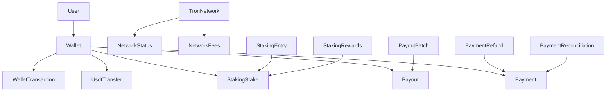
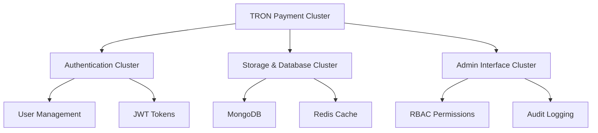

# TRON Payment Cluster - Data Models

## Core Data Models

### TRON Network Models

#### TronNetworkInfo
```typescript
interface TronNetworkInfo {
  network_name: string;
  network_id: string;
  chain_id: string;
  current_height: number;
  block_time: number;
  total_supply: string;
  circulating_supply: string;
  energy_price: string;
  bandwidth_price: string;
}
```

#### TronNetworkStatus
```typescript
interface TronNetworkStatus {
  status: 'healthy' | 'degraded' | 'down';
  current_height: number;
  sync_percentage: number;
  last_block_time: Date;
  node_count: number;
  network_hash_rate: string;
}
```

#### TronNetworkFees
```typescript
interface TronNetworkFees {
  energy_price: string;
  bandwidth_price: string;
  transaction_fee: string;
  smart_contract_fee: string;
}
```

### Wallet Models

#### Wallet
```typescript
interface Wallet {
  wallet_id: string;
  user_id: string;
  name: string;
  address: string;
  currency: 'TRX' | 'USDT';
  network: 'TRON';
  balance: number;
  is_active: boolean;
  hardware_wallet: boolean;
  created_at: Date;
  updated_at: Date;
}
```

#### WalletBalance
```typescript
interface WalletBalance {
  wallet_id: string;
  address: string;
  currency: string;
  balance: number;
  balance_formatted: string;
  last_updated: Date;
}
```

#### WalletTransaction
```typescript
interface WalletTransaction {
  tx_id: string;
  hash: string;
  type: 'transfer' | 'receive' | 'stake' | 'unstake' | 'reward';
  amount: number;
  currency: string;
  from_address: string;
  to_address: string;
  status: 'pending' | 'confirmed' | 'failed';
  timestamp: Date;
  block_height: number;
  fee: number;
}
```

### USDT Models

#### UsdtTransfer
```typescript
interface UsdtTransfer {
  transfer_id: string;
  tx_id: string;
  status: 'pending' | 'confirmed' | 'failed';
  amount: number;
  from_address: string;
  to_address: string;
  submitted_at: Date;
  confirmed_at?: Date;
}
```

#### UsdtTransaction
```typescript
interface UsdtTransaction {
  tx_id: string;
  hash: string;
  type: 'transfer' | 'receive' | 'approve';
  amount: number;
  from_address: string;
  to_address: string;
  status: 'pending' | 'confirmed' | 'failed';
  timestamp: Date;
  block_height: number;
  fee: number;
}
```

#### UsdtAllowance
```typescript
interface UsdtAllowance {
  owner_address: string;
  spender_address: string;
  allowance: number;
  allowance_formatted: string;
  last_updated: Date;
}
```

### Payout Models

#### Payout
```typescript
interface Payout {
  payout_id: string;
  status: 'pending' | 'processing' | 'completed' | 'failed' | 'cancelled';
  amount: number;
  currency: 'TRX' | 'USDT';
  recipient_address: string;
  tx_id?: string;
  submitted_at: Date;
  completed_at?: Date;
  failure_reason?: string;
}
```

#### PayoutBatch
```typescript
interface PayoutBatch {
  batch_id: string;
  payout_count: number;
  successful_count: number;
  failed_count: number;
  payout_ids: string[];
  submitted_at: Date;
}
```

### Staking Models

#### StakingStake
```typescript
interface StakingStake {
  stake_id: string;
  tx_id: string;
  status: 'pending' | 'confirmed' | 'failed';
  amount: number;
  wallet_address: string;
  submitted_at: Date;
  confirmed_at?: Date;
}
```

#### StakingEntry
```typescript
interface StakingEntry {
  entry_id: string;
  amount: number;
  staked_at: Date;
  unlock_time: Date;
  is_unlocked: boolean;
}
```

#### StakingRewards
```typescript
interface StakingRewards {
  address: string;
  period: string;
  total_rewards: number;
  total_rewards_formatted: string;
  reward_entries: RewardEntry[];
}
```

#### RewardEntry
```typescript
interface RewardEntry {
  date: Date;
  amount: number;
  amount_formatted: string;
  type: 'staking' | 'voting' | 'resource';
}
```

### Payment Models

#### Payment
```typescript
interface Payment {
  payment_id: string;
  status: 'pending' | 'processing' | 'completed' | 'failed' | 'cancelled';
  amount: number;
  currency: 'TRX' | 'USDT';
  recipient_address: string;
  tx_id?: string;
  submitted_at: Date;
  completed_at?: Date;
  failure_reason?: string;
}
```

#### PaymentRefund
```typescript
interface PaymentRefund {
  refund_id: string;
  payment_id: string;
  status: 'pending' | 'processing' | 'completed' | 'failed';
  amount: number;
  tx_id?: string;
  submitted_at: Date;
}
```

#### PaymentReconciliation
```typescript
interface PaymentReconciliation {
  date: Date;
  currency: string;
  total_amount: number;
  total_transactions: number;
  completed_transactions: number;
  failed_transactions: number;
  pending_transactions: number;
  reconciliation_data: ReconciliationEntry[];
}
```

#### ReconciliationEntry
```typescript
interface ReconciliationEntry {
  transaction_id: string;
  amount: number;
  status: string;
  timestamp: Date;
  tx_hash: string;
}
```

## MongoDB Collections

### Collections Structure

#### tron_networks
```javascript
{
  _id: ObjectId,
  network_name: String,
  network_id: String,
  chain_id: String,
  current_height: Number,
  block_time: Number,
  total_supply: String,
  circulating_supply: String,
  energy_price: String,
  bandwidth_price: String,
  last_updated: Date,
  created_at: Date
}
```

#### wallets
```javascript
{
  _id: ObjectId,
  wallet_id: String,
  user_id: String,
  name: String,
  address: String,
  currency: String,
  network: String,
  balance: Number,
  is_active: Boolean,
  hardware_wallet: Boolean,
  created_at: Date,
  updated_at: Date
}
```

#### wallet_transactions
```javascript
{
  _id: ObjectId,
  tx_id: String,
  wallet_id: String,
  hash: String,
  type: String,
  amount: Number,
  currency: String,
  from_address: String,
  to_address: String,
  status: String,
  timestamp: Date,
  block_height: Number,
  fee: Number,
  created_at: Date
}
```

#### usdt_transfers
```javascript
{
  _id: ObjectId,
  transfer_id: String,
  tx_id: String,
  status: String,
  amount: Number,
  from_address: String,
  to_address: String,
  submitted_at: Date,
  confirmed_at: Date,
  created_at: Date
}
```

#### usdt_transactions
```javascript
{
  _id: ObjectId,
  tx_id: String,
  hash: String,
  type: String,
  amount: Number,
  from_address: String,
  to_address: String,
  status: String,
  timestamp: Date,
  block_height: Number,
  fee: Number,
  created_at: Date
}
```

#### payouts
```javascript
{
  _id: ObjectId,
  payout_id: String,
  status: String,
  amount: Number,
  currency: String,
  recipient_address: String,
  tx_id: String,
  submitted_at: Date,
  completed_at: Date,
  failure_reason: String,
  created_at: Date
}
```

#### payout_batches
```javascript
{
  _id: ObjectId,
  batch_id: String,
  payout_count: Number,
  successful_count: Number,
  failed_count: Number,
  payout_ids: [String],
  submitted_at: Date,
  created_at: Date
}
```

#### staking_stakes
```javascript
{
  _id: ObjectId,
  stake_id: String,
  tx_id: String,
  status: String,
  amount: Number,
  wallet_address: String,
  submitted_at: Date,
  confirmed_at: Date,
  created_at: Date
}
```

#### staking_entries
```javascript
{
  _id: ObjectId,
  entry_id: String,
  wallet_address: String,
  amount: Number,
  staked_at: Date,
  unlock_time: Date,
  is_unlocked: Boolean,
  created_at: Date
}
```

#### staking_rewards
```javascript
{
  _id: ObjectId,
  address: String,
  period: String,
  total_rewards: Number,
  total_rewards_formatted: String,
  reward_entries: [{
    date: Date,
    amount: Number,
    amount_formatted: String,
    type: String
  }],
  created_at: Date
}
```

#### payments
```javascript
{
  _id: ObjectId,
  payment_id: String,
  status: String,
  amount: Number,
  currency: String,
  recipient_address: String,
  tx_id: String,
  submitted_at: Date,
  completed_at: Date,
  failure_reason: String,
  created_at: Date
}
```

#### payment_refunds
```javascript
{
  _id: ObjectId,
  refund_id: String,
  payment_id: String,
  status: String,
  amount: Number,
  tx_id: String,
  submitted_at: Date,
  created_at: Date
}
```

#### payment_reconciliations
```javascript
{
  _id: ObjectId,
  date: Date,
  currency: String,
  total_amount: Number,
  total_transactions: Number,
  completed_transactions: Number,
  failed_transactions: Number,
  pending_transactions: Number,
  reconciliation_data: [{
    transaction_id: String,
    amount: Number,
    status: String,
    timestamp: Date,
    tx_hash: String
  }],
  created_at: Date
}
```

## Validation Rules

### Wallet Validation
```typescript
const walletValidation = {
  name: {
    required: true,
    minLength: 1,
    maxLength: 255,
    pattern: /^[a-zA-Z0-9\s\-_]+$/
  },
  address: {
    required: true,
    pattern: /^T[A-Za-z1-9]{33}$/,
    message: "Invalid TRON address format"
  },
  currency: {
    required: true,
    enum: ['TRX', 'USDT']
  },
  balance: {
    type: 'number',
    minimum: 0
  }
};
```

### USDT Transfer Validation
```typescript
const usdtTransferValidation = {
  from_address: {
    required: true,
    pattern: /^T[A-Za-z1-9]{33}$/,
    message: "Invalid TRON address format"
  },
  to_address: {
    required: true,
    pattern: /^T[A-Za-z1-9]{33}$/,
    message: "Invalid TRON address format"
  },
  amount: {
    required: true,
    type: 'number',
    minimum: 0.000001,
    message: "Amount must be at least 0.000001 USDT"
  },
  memo: {
    maxLength: 255,
    pattern: /^[a-zA-Z0-9\s\-_.,!?]+$/
  }
};
```

### Payout Validation
```typescript
const payoutValidation = {
  recipient_address: {
    required: true,
    pattern: /^T[A-Za-z1-9]{33}$/,
    message: "Invalid TRON address format"
  },
  amount: {
    required: true,
    type: 'number',
    minimum: 0.000001,
    message: "Amount must be at least 0.000001"
  },
  currency: {
    required: true,
    enum: ['TRX', 'USDT']
  },
  priority: {
    enum: ['low', 'normal', 'high'],
    default: 'normal'
  }
};
```

### Staking Validation
```typescript
const stakingValidation = {
  wallet_address: {
    required: true,
    pattern: /^T[A-Za-z1-9]{33}$/,
    message: "Invalid TRON address format"
  },
  amount: {
    required: true,
    type: 'number',
    minimum: 1000,
    message: "Minimum staking amount is 1000 TRX"
  }
};
```

## Data Relationships

### Entity Relationships


### Cross-Cluster Relationships


## Data Consistency Rules

### TRON Network Data
- Network information must be updated every 3 seconds
- Network status must be checked every 10 seconds
- Network fees must be refreshed every 30 seconds
- All network data must be validated against TRON mainnet

### Wallet Data
- Wallet balances must be synchronized every 5 minutes
- Wallet transactions must be indexed within 1 minute of confirmation
- Hardware wallet connections must be verified every 30 seconds
- Wallet addresses must be validated against TRON address format

### USDT Data
- USDT balances must be updated every 2 minutes
- USDT transactions must be processed within 30 seconds
- USDT allowances must be checked before transfers
- USDT contract interactions must be logged

### Payout Data
- Payout status must be updated every 30 seconds
- Payout batches must be processed within 5 minutes
- Payout history must be retained for 7 years
- Payout reconciliation must be performed daily

### Staking Data
- Staking status must be updated every 10 minutes
- Staking rewards must be calculated daily
- Staking entries must be validated against TRON network
- Staking withdrawals must be processed within 24 hours

### Payment Data
- Payment status must be updated every 15 seconds
- Payment reconciliation must be performed hourly
- Payment refunds must be processed within 48 hours
- Payment webhooks must be delivered within 5 seconds

## Data Security Models

### Encryption Requirements
```typescript
interface EncryptionConfig {
  private_keys: {
    algorithm: 'AES-256-GCM';
    key_derivation: 'PBKDF2';
    iterations: 100000;
  };
  sensitive_data: {
    algorithm: 'AES-256-CBC';
    key_derivation: 'scrypt';
    memory_cost: 65536;
  };
  api_keys: {
    algorithm: 'AES-256-GCM';
    key_rotation: '30 days';
  };
}
```

### Access Control
```typescript
interface AccessControl {
  wallet_operations: {
    read: ['user', 'admin'];
    write: ['user', 'admin'];
    delete: ['admin'];
  };
  payout_operations: {
    read: ['user', 'admin'];
    write: ['admin'];
    delete: ['admin'];
  };
  staking_operations: {
    read: ['user', 'admin'];
    write: ['user', 'admin'];
    delete: ['admin'];
  };
  payment_operations: {
    read: ['user', 'admin'];
    write: ['admin'];
    delete: ['admin'];
  };
}
```

### Audit Logging
```typescript
interface AuditLog {
  event_type: string;
  user_id: string;
  resource_type: string;
  resource_id: string;
  action: string;
  timestamp: Date;
  ip_address: string;
  user_agent: string;
  success: boolean;
  error_message?: string;
}
```

---

**Document Version**: 1.0.0  
**Last Updated**: 2025-01-10  
**Next Review**: 2025-02-10
